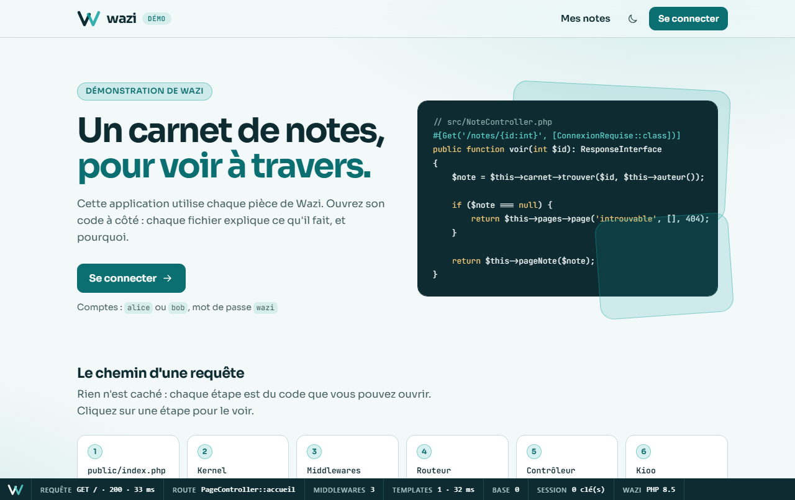
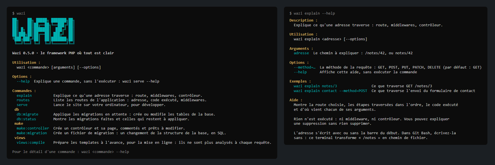

<p align="center">
  <picture>
    <source media="(prefers-color-scheme: dark)" srcset="docs/brand/wazi-mark-dark.svg">
    
  </picture>
</p>

<h1 align="center">Wazi</h1>

<p align="center"><em>« clair, ouvert, évident » en swahili</em></p>

<p align="center">
  <a href="https://github.com/wazi-php/wazi/actions/workflows/ci.yml"></a>
  <a href="https://github.com/wazi-php/wazi/releases"></a>
  
  <a href="LICENSE"></a>
</p>

Wazi est un framework PHP pensé pour les développeurs qui veulent **comprendre** ce qu'ils utilisent tout en construisant de vraies applications. Pas de magie cachée : chaque comportement se suit dans l'éditeur par un clic, chaque erreur explique sa cause et la solution.

<p align="center">
  
</p>

> **Wazi est en construction.**  Ce qui est décrit ici fonctionne et est testé, mais l'API peut encore changer avant la version 1.0. Ce qui change d'une version à l'autre est dans le [journal des modifications](CHANGELOG.md).

## Ce que fait Wazi

| | |
| --- | --- |
| **Routes et contrôleurs** | Adresses avec paramètres, routes écrites à côté de leur code (`#[Get('/notes/{id:int}')]`), dépendances fournies par le conteneur |
| **Templates Kioo** | Des pages HTML ordinaires, quelques attributs en plus, tout ce qui s'affiche est échappé |
| **Zones mises à jour** | Un formulaire ou un lien ne remplace qu'un morceau de la page, sans la recharger ; le contrôleur ne change pas, et tout marche sans JavaScript |
| **Formulaires** | Protection contre la falsification de requête sans rien écrire, validation champ par champ |
| **Base de données** | SQLite, MySQL, PostgreSQL ; du SQL en clair, des valeurs toujours à part, des migrations |
| **Sessions et configuration** | Connexion, messages d'une page à l'autre, réglages et secrets hors du code |
| **Console** | `wazi serve`, `wazi routes`, `wazi explain`, des générateurs, et vos propres commandes |
| **Barre de débogage** | En développement, en bas de la page : la route, le code exécuté, les templates, la durée. Jamais un secret |
| **Erreurs pédagogiques** | Chaque erreur dit ce qui s'est passé, pourquoi, et comment corriger |
| **Sécurité par défaut** | Tout est protégé sans configuration ; désactiver une protection demande un geste explicite et local |

## Un premier exemple

Une application tient dans un seul fichier :

```php
<?php

use Psr\Http\Message\ServerRequestInterface;
use Wazi\Http\Response;
use Wazi\Kernel\Kernel;

require __DIR__ . '/../vendor/autoload.php';

$app = new Kernel();

$app->router->get('/articles/{id:int}', function (ServerRequestInterface $request) {
    $id = $request->getAttribute('id');   // un int, garanti par la contrainte

    return new Response(200, ['Content-Type' => 'text/plain; charset=utf-8'], "Article n° $id");
});

$app->run();
```

Quand le projet grandit, le même code se range en contrôleurs, en services et en templates, sans réécriture :

```php
final readonly class NoteController
{
    public function __construct(private Database $db, private Kioo $kioo) {}

    #[Get('/notes/{id:int}')]
    public function voir(int $id): ResponseInterface
    {
        $note = $this->db->selectOne('SELECT * FROM notes WHERE id = ?', [$id]);

        return $this->kioo->page('note', ['note' => $note]);
    }
}
```

## La console

<p align="center">
  
</p>

`wazi` lance le site, liste les routes, explique ce qu'une adresse traverse, crée un contrôleur ou une migration. Chaque commande s'explique avec `--help`.

## Essayer

Il faut PHP 8.5 et Composer. Wazi n'est pas encore publié sur Packagist : pour l'instant, on l'essaie depuis ce dépôt.

```bash
git clone https://github.com/wazi-php/wazi.git
cd wazi
composer install
```

Trois applications à lancer et à lire, de la plus simple à la plus complète :

```bash
php -S localhost:8000 examples/bonjour.php          # un seul fichier, des routes écrites comme des fonctions
php -S localhost:8000 examples/carnet/index.php     # un contrôleur, un service, des pages en Kioo
cd examples/demo && php wazi serve                  # une application complète, rangée comme un vrai projet
```

La troisième, [la démonstration](examples/demo/README.md), montre une connexion, un carnet de notes par utilisateur, des formulaires protégés et des réglages.

Le jour de la publication, un projet se créera en une commande, à partir du [projet de départ](https://github.com/wazi-php/wazi-skeleton) :

```bash
composer create-project wazi/skeleton mon-projet
```

## Documentation

- [Le guide](docs/README.md), en seize pages, de la première route à la mise en ligne.
- [Le journal des modifications](CHANGELOG.md) : ce qui change d'une version à l'autre.
- [Les décisions d'architecture](docs/decisions/) : pourquoi chaque pièce est faite comme elle l'est.

## Principes

Ils tranchent toutes les décisions. Une fonctionnalité qui en viole un est refusée ou repensée.

1. **Transparence avant magie.** Tout se suit dans l'éditeur par un clic.
2. **Zéro configuration obligatoire.** Des valeurs par défaut sensées partout.
3. **Complexité progressive.** Un fichier au départ, une application structurée ensuite.
4. **Erreurs pédagogiques.** Quoi, pourquoi, comment corriger.
5. **Code source lisible.** Le cœur reste assez petit pour être lu.
6. **PHP moderne uniquement.** PHP 8.5 au minimum.
7. **Standards PSR respectés.** PSR-7, PSR-11, PSR-15, PSR-17.
8. **Sécurité stricte, jamais pénible.** Le défaut est sûr ; ce qui est dangereux demande un geste explicite, nommé et local.

## Kioo


Kioo (« vitre » en swahili) est le langage de templates de Wazi : une page HTML ordinaire, avec quelques attributs en plus.

```html
<k:layout name="base">

<ul>
    <li k:for="note in notes" class="{note.importante ? 'importante' : ''}">
        <a href="/notes/{note.id}">{note.texte}</a>
    </li>
    <li k:else>Aucune note pour l'instant.</li>
</ul>
```

Tout ce qui est affiché est échappé selon l'endroit où il se trouve.

## Architecture

Les composants sont rangés en quatre couches. Une couche peut utiliser celles du dessous, jamais celles du dessus ; deux composants d'une même couche ne se connaissent pas. La règle est vérifiée par Deptrac à chaque changement.

| Couche | Composants |
| --- | --- |
| Assemblage | `Kernel` |
| Fonctionnalités | `Routing`, `Middleware`, `Errors`, `View`, `Console`, `Validation`, `Database`, `Debug` |
| Fondations | `Http`, `Container`, `Config` |
| Contrats | `Contracts` |

Les seules dépendances d'exécution sont les paquets d'interfaces PSR.

## Sécurité

Wazi applique une sécurité stricte par défaut. Pour signaler une faille, voir [SECURITY.md](SECURITY.md) : jamais dans une issue publique.

## Contribuer

Le projet travaille sur des branches, fusionnées dans `main` par des demandes de fusion. Tout est expliqué dans [CONTRIBUTING.md](CONTRIBUTING.md). En participant, vous acceptez son [code de conduite](CODE_OF_CONDUCT.md).

```bash
composer check   # audit des dépendances, style, analyse statique, couches, tests
```

## Licence

[MIT](LICENSE)
